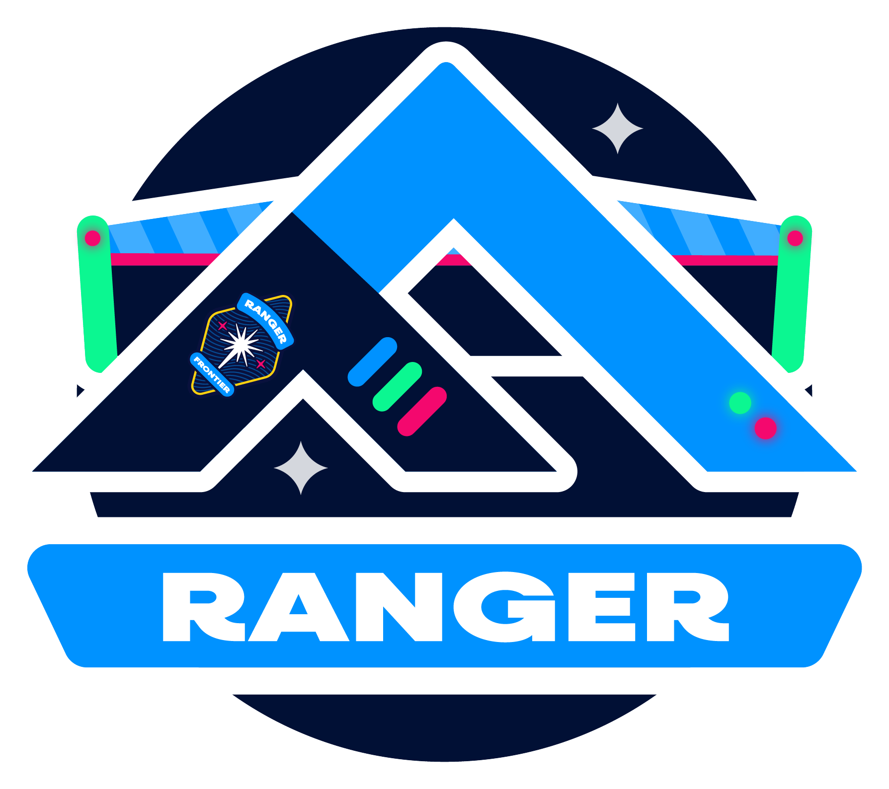

.. image:: https://github.com/gofrontier-com/ranger/actions/workflows/ci.yml/badge.svg
    :target: https://github.com/gofrontier-com/ranger/actions/workflows/ci.yml

|

======
Ranger
======

Ranger is a command line tool that enables "GitOps for everything" by providing
a technology-agnostic contract-based framework to define how universal workloads
(and their associated configuration and secrets) are built, tested, deployed,
destroyed and promoted through environments.

.. contents:: Table of Contents
    :local:

-----
About
-----

Ranger has been built to enable organisations to build, test, configure, deploy, destroy and promote
universal workloads (infrastructure, platform, application, data - anything!) using GitOps
inside the existing CI/CD system (without need to deploy additional platform tooling).

It was created by a platform team who were using tools like Flux and ArgoCD for GitOps at
the application layer, and wanted the same outcomes at the infrastructure and platform layer.

Ranger enables those GitOps outcomes - including improved efficiency and security,
a better developer experience, reduced costs, and faster deployments - at all layers of
the stack, all from your existing CI/CD system.

--------
Concepts
--------

Video?

Mermaid diagram?

~~~~~~
GitOps
~~~~~~

GitOps uses Git repositories as a single source of truth to deliver infrastructure as code.
Submitted code checks the CI process, while the CD process checks and applies requirements
for things like security, infrastructure as code, or any other boundaries set for the
application framework. All changes to code are tracked, making updates easy while also
providing version control should a rollback be needed.

~~~~~~~~~
Workloads
~~~~~~~~~

Something about reusable units of business value (?) that have a common interface regardless of implementation, i.e. build, test, deploy, check, destroy.

~~~~
Sets
~~~~

Something about what a set represents, like application, user journey, tier/stack?

--------
Workflow
--------

--------
Download
--------

~~~~~~~~~~~~
Azure DevOps
~~~~~~~~~~~~

Release
~~~~~~~

Binaries and packages of the latest stable release are available at `https://github.com/gofrontier-com/ranger/releases <https://github.com/gofrontier-com/ranger/releases>`_.

Extension
~~~~~~~~~

The Ranger extension for Azure DevOps is available from `Visual Studio Marketplace <https://marketplace.visualstudio.com/items?itemName=gofrontier.ranger>`_, which will automatically install Ranger via a task.

~~~~~~~~~~~~~~
GitHub Actions
~~~~~~~~~~~~~~

*Coming soon...*

~~~~~~~
Jenkins
~~~~~~~

*Coming soon...*

-------------
Configuration
-------------

~~~~~~~~
Examples
~~~~~~~~

Example workload and set manifest?

.. code:: yaml

  ---
  version: 23
  environment: dev
  set: core-infra
  nextEnvironment: prd
  workloads:
    - name: microsoft-defender
      type: Shared/microsoft-defender-workload
      version: 1.5.1
    - name: virtual-network
      type: Shared/virtual-network-workload
      verson: 3.1.7
    - name: sql-server
      type: Shared/sql-server-workload
      version: 2.9.3
    - name: app-gateway
      type: Shared/app-gateway-workload
      version: 1.1.8

.. code:: yaml

  ---
  version: 9
  environment: dev
  set: creditcards-infra
  nextEnvironment: prd
  workloads:
    - name: kubernetes-cluster
      type: Shared/kubernetes-cluster-workload
      version: 6.0.3
    - name: app-gateway-ingress
      type: Shared/app-gateway-ingress-workload
      version: 1.0.2
    - name: api-gateway-service
      type: Shared/api-gateway-service-workload
      version: 11.3.1
    - name: statements-service
      type: CreditCardsLZ/statements-service-workload
      version: 1.7.3

.. code:: yaml

  ---
  version: 17
  environment: dev
  set: currentaccounts-infra
  nextEnvironment: prd
  workloads:
    - name: kubernetes-cluster
      type: Shared/kubernetes-cluster-workload
      version: 6.0.3
    - name: app-gateway-ingress
      type: Shared/app-gateway-ingress-workload
      version: 1.0.2
    - name: api-gateway-service
      type: Shared/api-gateway-service-workload
      version: 11.3.1
    - name: withdrawal-service
      type: CurrentAccountsLZ/withdrawal-service-workload
      version: 5.1.9

------------
Contributing
------------

We welcome contributions to this repository. Please see `CONTRIBUTING.md <https://github.com/gofrontier-com/ranger/tree/main/CONTRIBUTING.md>`_ for more information.
